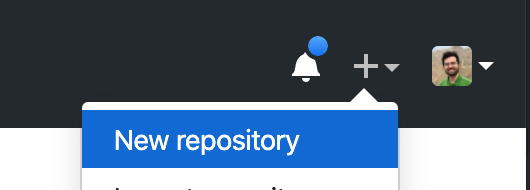
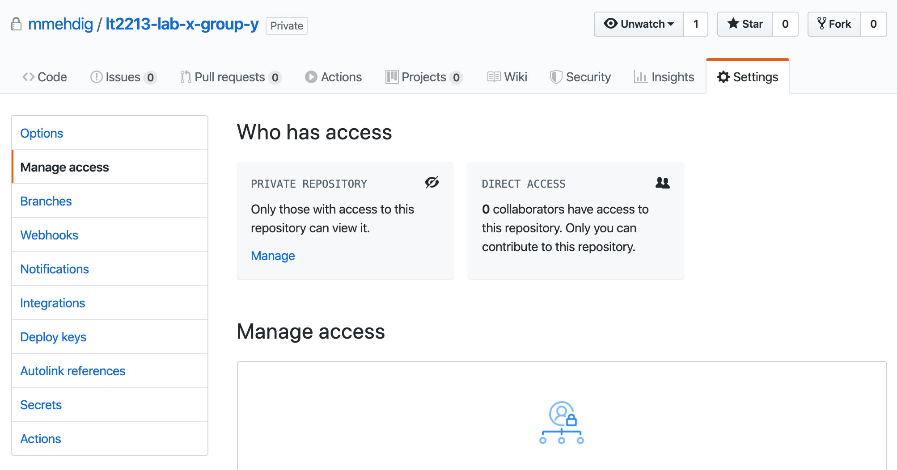
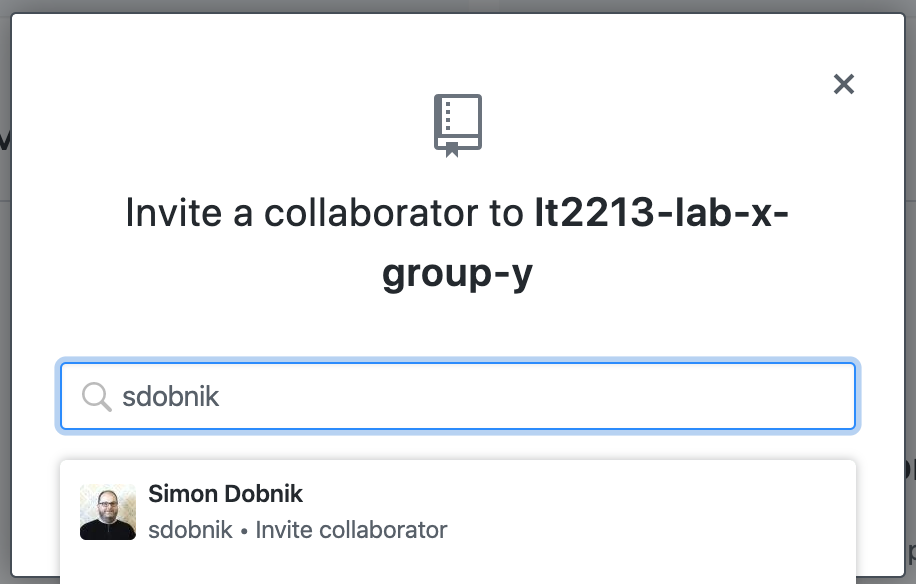

# Computational Semantics (LT2213)

Labs and other materials for LT2213 Computational semantics


# Group work guidlines

## Table of content
1. [Requirements](#requirements)
2. [Setting up a group assignment](#start-a-group-lab)
3. [Working on the assignments](#working-on-the-assignments)
4. [Submitting the work](#submitting-the-work)


## Requirements

In order to submit the assignment every member of the group should have a Github account and at least one member will need a private Github repository with extras that are available for free to students:

1. If you don't have `git`, install it on your system (https://git-scm.com/book/en/v2/Getting-Started-Installing-Git).
1. Sign up for GitHub (https://github.com/).
1. Go to https://education.github.com/ and sign up for the Student Developer Pack to get unlimited private repositories and the ability to add several collaborators. You are a "student" and you want an "individual account". Once you have completed these first steps, you are then ready to create your private GitHub repository for this class.
1. Setup your terminal acceess with ssh-key from your local computer to your Github account. (https://github.com/settings/keys)

We will use Jupiter notebooks to write and run the code. To learn how to install and use Jupyter notebook, please have a look [here](http://jupyter.org/index.html).


## Setting up a group assignment

Everyone in the group is expected first to work on the assignment individually.
The group work gives you a chance to resolve issues and to learn about alternative possible solutions.
The intention of these guidelines is to help you with working remotely.

Each group should select two members, one for each of the following roles:
- Repository manager (for example `userm`): creates and owns a repository for the group and sets up access for other memebers and teachers.
- Final submission admin (for example `userf`): shares their screen when preparing and discussing the final group submission. You may alternate the role of the final submission admin for different questions.


#### Repository manager

- Choose one person as a repository manager (For example `userm`).
- `userm` creates a private github repository. (Initialise with README and ignore Python):
   - [Follow this link.](https://github.com/new)
   
  
  
   - The repository's name should follow the following convention: `lt2213-lab-x-group-y` (`x` for the lab number and `y` for group number). As in the picture:
   


- In the repositories `Settings` add all group members and all course instructors (`adamlek`, `mmehdig`, `sdobnik`) as collaborators with the Admin role.






- `userm` should then add the lab material from our repository as a module to your repository.
In the terminal:
```
git clone git@github.com:<userm>/<lt2213-lab-x-group-y>
cd <lt2213-lab-x-group-y>
git submodule add https://github.com/sdobnik/computational-semantics
git commit -am "initialise the submodule"
git push
```

#### All members

Every member should:

- Clone from the group repository. In the terminal:
```
git clone --recurse-submodules git@github.com:<userm>/<lt2213-lab-x-group-y>
cd <lt2213-lab-x-group-y>
```
- Create a copy of the problem-set folder containg the lab in the root of ther group repository and name it with your username. In the terminal:
```
cp -R computational-semantics/problem-set-#/ <username>
```
*if you see an error about not existing directory, perhaps you need to pull the submodule and try again:*
```
 git pull --recurse-submodules
```
- Share your work with others by adding and committing your files to the repository:
```
git add <username>
git commit -m "message about what you are committing here."
git pull
git push
```
- Check for updates by updating your repository with the pull command:
```
git pull
```

## Working on the assignments

### Everyday work

Working remotely may be challenging. It is very important that every member of the group participates and learns from working on the assignments and by interacting with the rest of the group.
Here is how to optimise the work with your team.

- First, try to solve the questions individually by writing out your own solutions in your own version of the notebook.
- Then meet online in the Zoom classroom as a group with some points for discussion prepared based on your individual work.
- Let also others try to solve the question first on their own.
- If you don't understand a question, or you if you encounter an error discuss this with other members.
- If you need clarification from the teachers, write your questions to the general Canvas discussion topic for Lab 1 rather than sending us individual emails. This is to ensure that if we provide additional information about the assignments, the information will be available for everyone.
- There might be more than one solution for each question.
- After everyone found and ran an answer for each question, start the work on the final group submission in a separate notebook.
- When working on this submission, one user `userf` should act as an editor and administrator.

#### Administrating the final group submission

The admin user for the final submission, for example `userf`, is responsible for editing the file and managing the online meeting while working on the final version. In particular they should,

- Share their screen with other team members.
- The group version should be constructed in a way that it consists of contributions of everyone.
- Make a copy of their notebook and name it final:
```
cp -R <userf> final
git add final
```
- Initiate a discussion how to modify these solutions given the contributions of each member.
- When you reach a consesus, update the solutions to the ones that you have agreed on.
- You may swap the roles of `userf` between different questions. If so, the current `userf` should commit and push the solutions to Github and then the new `userf` should pull them to their computer.

## Submitting your work

Please submit the assignment **as a group** through Canvas by including the URL of your Github repository and the commit id that you would like us to consider, e.g. `commit 565a042652b2ae7500eeda435a1771282563c08a`. You can find out the commit id by doing `git log`.
