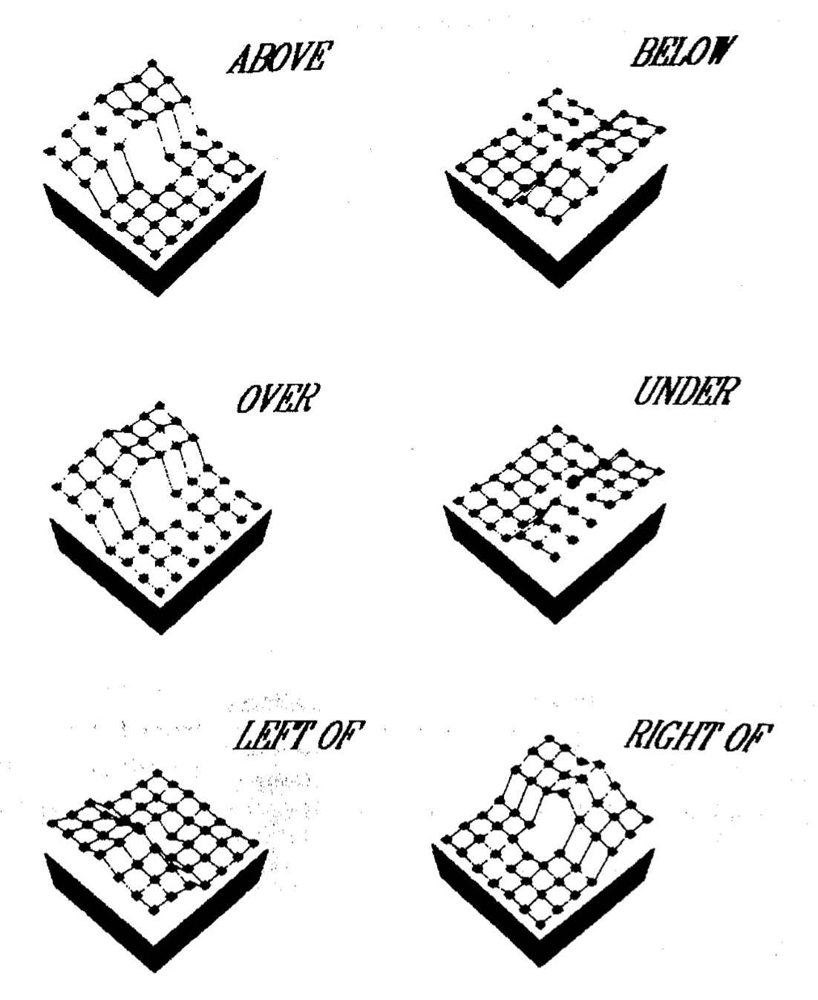

## Distributed representations

Y. Bengio, R. Ducharme, P. Vincent, and C. Janvin. [A neural probabilistic language model.](https://www.jmlr.org/papers/volume3/bengio03a/bengio03a.pdf) Journal of Machine Learning Research, 3(6):1137–1155, 2003.

M. Ghanimifard and S. Dobnik. [Learning to compose spatial relations with grounded neural language models.](https://gup.ub.gu.se/publication/257763?lang=en) In C. Gardent and C. Retoré, editors, Proceedings of IWCS 2017: 12th International Conference on Computational Semantics, pages 1–12, Montpellier, France, September 19–22 2017. Association for Computational Linguistics.

### Questions to discuss

For the first paper:

* Some concepts: syntagmatic and paradigmatic relations, one-hot vector representation, dense embeddings, word2vec, CBOW, skip-gram, Gensim, GloVe, LSTM
* What is the difference between distributional word vectors/matrices, word vectors with dimensionality reduction and word embeddings?
* What are the benefits and weaknesses of using word embeddings compared to other word representations mentioned in the previous point both in terms of the nature of representation and computational cost building and using them?
* What kind of word embeddings can we build; what are differences between?
* What is a probabilistic language model? How do word embeddings relate to a probabilistic language model?

For the second paper:

* Can compositionality be learned from data?
* Why do we ground our language model in perceptual information/locations?
* To what degree are distributional composed representations interpretable?
* Are the representations that we have learned the same as those as we would expect from compositional rules?
* Neural networks are also compositional models in the sense that they are composed of units and each of these units defines some representations. Do you agree?
* To what degree can we say that a neural network has learned compositional functions like those in formal semantics?

### Simon's notes

On the Bengio et al.'s paper

* *language modelling:* joint probability function of a sequences of words in a language P(w*1^T) = product P(w*t|w_1t-1) for t=1 to T
  * the joint probability can be decomposed as a product of conditional probabilities
* *curse of dimensionality:* we may observe new sequences of words never encountered before; the problem of modelling labels rather than continuous variables which are connected
* *in statistical n-gram models:* estimate probability of words only on n-previous words; typically 3; but we want to take into account larger contexts
* *in distributed representations:* we **learn** the probability function **g** with a feed-forward recurrent neural network
  * for each word we learn a word-feature vector, i.e. word embeddings
  * learn a seqeunce of word feature vectors with a neural network which will give the joint probability function; feature vectors contain *continuous variables*, hence we take into account semantic similarity between words and are able to better generalise to unseen data
  * this is why we need to turn words into embeddings first
  * maximise the log-likelihood ratio of the training data (i.e. not loss and hence we are maximising); log-likelihood will be obtained for each word, hence to update the model we take an average log likelihood 1/T; why don't we take a product (hint: we are updating the model!)
* two hidden layers:
  * word features layer C where parameters are shared accross words, word embeddings
  * feature vectors are concatenated to one hidden layer to learn the probability function with a tanh activation
* sofmax later to make the outputs sum to 1
* stochastic gradient decent is used to optimiase the parameters
* evaluation on the Brown corpus; hidden layers force better generalisation; this is why neural networks are called to be *deep* - we learn underlying representations
* recurrent neural networks are very natural way of modelling language which is sequential
* More details in Chapter 7 and Chapter 9 of D. Jurafsky and J. H. Martin. Speech and language processing: an introduction to natural language processing, computational linguistics, and speech recognition. Third edition draft, Stanford University and University of Colorado at Boulder, December 30 2020. <https://web.stanford.edu/>[\\\~jurafsky/slp3/ed3book.pdf](https://web.stanford.edu/%5C~jurafsky/slp3/ed3book.pdf)

On Ghanimifard and Dobnik's paper

* To what degree are functions learned by neural networks compositional?
  * we test this if they relate to a model in a compositional way: each linguistic represnetation should be relatable to some entities or relations/sets of entity tuples in a model
  * we choose perceptual represnetations from human grounding scores in a spatial task as a model
* Combines *probabilistic language models* with *models of grounded language*
  * meaning is relation between words and some representations of the world
* For lexical semantics we combine word embeddings estimated from contexts with grounding of words in a spatial task; both representations are continuous (rather than discerete)
  * perceptual representations are locations (in a 7x7 grid) and a probability that each word describes that location
  * words can be grounded in different representations: pixels, colour codes, bounding boxes, geometric features; more on this in the AICS course
* Questions:
  * How does language models learns lexical semantics: how are different spatial words grounded in locations?
  * Language models also learn to predict sequences / compositions of words: is this also reflected at the level of grounding; are constituents grounded as expected?
* Approach
  * Spatial templates from Logan and Sadler, what are spatial templates?\
    
  * 7x7 grid and we have an average acceptability score for each cell; acceptability scores can be assumed to be probabilities; from these probabilities we generate a dataset by generating the number of individual examples per location proportional to the probability
  * spatial templates are available only for individual spatial relations; define artificial compositional functions for phrases: *and*, *either*, *or*, *not* mostly using mathematical functions on the spatial templates, e.g. prodct, complement, etc.
  * dataset one: simple and composed relations; dataset two: also other words (v) --> [the, object, is, v, the, box]
  * LSTM language model; the location vector is concatendated with the embedding vector
    * why not take product or other functions?
  * we get softmax predictions for all of the words; we do not need decoding since for spatial relations we are taking the probabilities of all relations and compare them with the original spatial templates
* Results
  * All words previously appear in all types of phrases (the training and testing set are the same): (i) Simple phrases and composed phrases; (ii) Simple phrases and composed phrases with distracting words
  * Words have been previously seen but not in the same kind of phrases: omit some combinations from training but expect that the model will generalise to these as confirmed in testing; omit diffrerent proportion of phrases
    * a word might be seen in a different composition; or a word that was seen in a composition is now egenrated as a single word
    * the amount of omission affects the performance of the model
  * some compositions are more difficult to learn than others, e.g. negation; some are non-sensical "either far from or next to"; perhaps dependent on the degree of the overlap of spatial templates; decomposition is perhaps more robust than composition: lesser decrease in performance with omission (not conclusive, data missing)
  * Adding distractor words makes the results only slightly weaker
  * Investigating loss and comparing it with the correlation between the predicted probabilities and spatial templates indicates that although the loss stabilises after a certain number of epochs further training still improves the correlation: this is because loss is not only expression of groundedness but also of learning sequence composition

### From the class, VT23

Terry Regier: Human semantic potential

* word embeddings vs word vectors
* deep networks, layers and generalisation
* use word vectors as a basis for training?
  * a form of pre-training
  * the neural network can be smaller and takes faster to train
* FastText and WordPiece
  * character based
* Grounding
  * linguistic representations to another modality
  * grounding in conversation
  * Bender and Koller, Wittgenstein, Searle

### From the class, VT22

* dense embeddings? dimension reduction
* differences between dsitributional and distributed embeddings
  * paradigmatic and syntagmatic relations are exploited in distributed models
  * what are paradigmatic and syntagmatic relations in word2vec models
  * one-hot-embeddings
* distributional embeddings are fixed (?) - distributed can be further trained?
* \+s and -s: reduction of dimensionality, adaptability for specific applications; interpretability and bias
* performance: the overhead of training; to train or not to train; learning vs inference
* different kinds of embeddings: skipgram, cbow, fasttext, wordpiece, GloVe and how it related to word2vec; SVD to distributional model is dense representations
  * hello: h e l l o he el ll lo
* grounding: connecting words to a model (truth values, the world)
  * differences for difference word classes;
  * the complexity of concepts/relations; relations vs entities; dog / apple / table more difficult to classify; colour, texture, flavour, smell, time?
  * affordances
  * we need several grounded models and how do we combine them?
* applications of grounding: when limited world; limitation for the real world
* interpretability? words can be interpreted to locations (interpretable)
* neural models are compositional: they compose words; but the rules are variable (probablistic); hard to extract the rules; we cannot exmaine the rules; rules can change; to what degree are what we expect them to be
  * the feature of neural network enables compositionality; left to right LSTM
  * are units of neural network meningful on their own - they capture compositional relations but not units are interpretable
* how much has industry/science changed from 2003 to today?
  * training such models now and then
  * higher cost of training vs collecting counts
  * how do neural models capture different languages: direction of writing and morphology